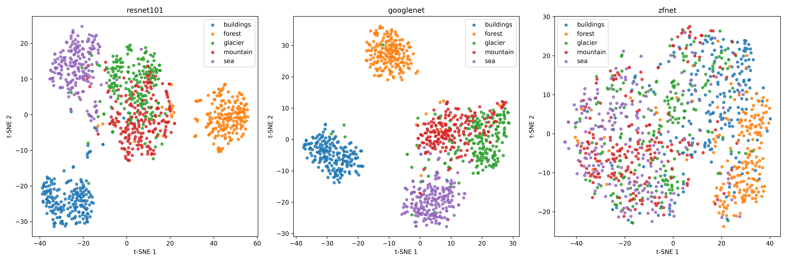
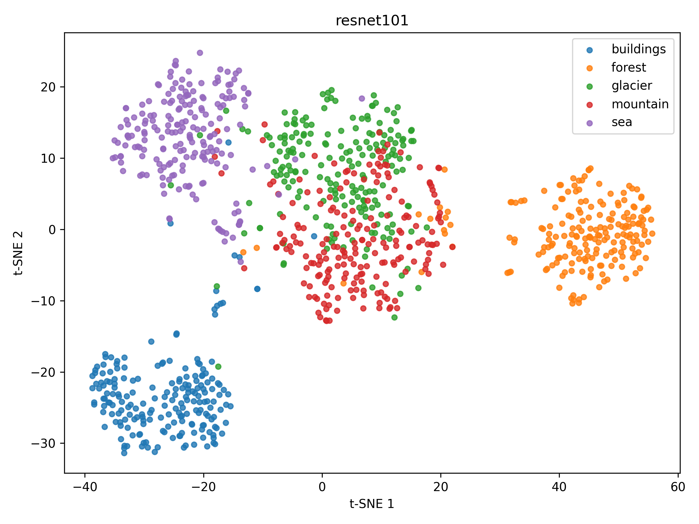
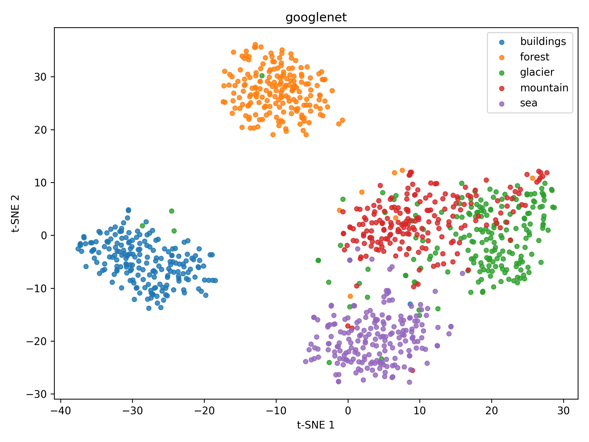
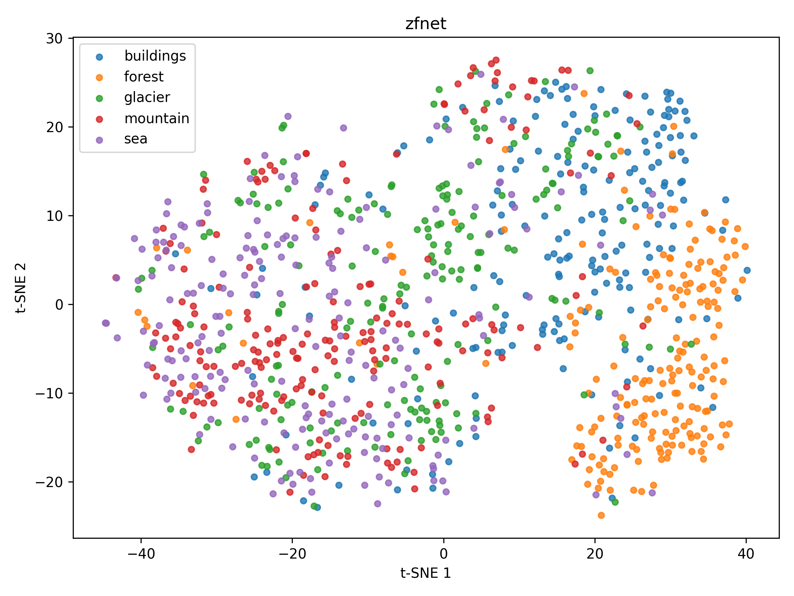

# Feature Understanding with Pre-trained CNNs

## 1. Project Topic

This project is about understanding and comparing the quality of image feature representations produced by different convolutional neural network architectures. Instead of training a new image classifier from the beginning, the project uses convolutional neural networks as feature extractors and studies whether their internal representations can group visually similar images together. The central idea is that a strong CNN should produce embeddings in which images from the same semantic category are close to each other, while images from different categories are farther apart.

The project uses a subset of the Intel Image Classification dataset, focusing on five natural and scene categories: buildings, forest, glacier, mountain, and sea. For each category, 200 images were selected, giving a total of 1,000 images. These images were processed through three CNN models: ResNet-101, GoogleNet, and ZFNet. The output classification layers of the models were removed or replaced so that the networks produced feature vectors instead of class prediction scores.

The broader context of the project is feature understanding in deep learning. In many computer vision tasks, pre-trained CNNs are useful not only as classifiers but also as general-purpose feature extractors. Their embedding spaces can be used for image retrieval, clustering, visualization, similarity search, and transfer learning. This project investigates that idea experimentally by comparing how well different CNN-based embeddings preserve class structure in the selected image dataset.

## 2. Objectives

The main objective of this project was to build a complete deep learning pipeline for extracting, comparing, evaluating, and visualizing image embeddings from multiple CNN architectures. The project aimed to determine which model produced the most meaningful feature space for the chosen dataset and to evaluate that feature space using both quantitative and visual methods.

A second objective was to measure nearest-neighbor consistency. For each class, one query image was selected, and the top 10 most similar images were retrieved using cosine similarity. If most retrieved neighbors belonged to the same class as the query image, the model was considered to have learned or preserved useful semantic structure in its embeddings. This allowed the project to compare the models from an image retrieval perspective rather than only from a classification perspective.

Another objective was to compare intra-class and inter-class cosine distances. Intra-class distance measures how far images from the same class are from each other in embedding space, while inter-class distance measures how far images from different classes are from each other. A model with strong feature separation should have a lower intra-class distance and a higher inter-class distance, producing a larger separation gap.

The project also aimed to create visual evidence of the embedding structure using t-SNE. Since the original embeddings have high dimensionality, t-SNE was used to reduce them to two dimensions. The resulting plots make it easier to observe whether images from the same class form visible clusters and whether different classes overlap. Overall, the project achieved a complete pipeline from raw image loading to final evaluation reports, saved metrics, similarity results, and visualization files.

## 3. Related Work

This project is closely related to work on convolutional neural networks for image recognition and representation learning. One important foundation is AlexNet, introduced by Krizhevsky, Sutskever, and Hinton in 2012, which demonstrated that deep CNNs could achieve major improvements on large-scale image classification tasks. ZFNet, proposed by Zeiler and Fergus, built on AlexNet and introduced architectural modifications along with visualization techniques for understanding intermediate CNN features. In this project, ZFNet was used as one of the compared architectures, although it was implemented manually with random weights because a suitable pre-trained version was not available in the installed libraries.

GoogleNet, introduced by Szegedy et al. in the Inception architecture, is another relevant model. It uses inception modules to combine convolutional filters of different sizes efficiently, allowing the network to capture multi-scale visual patterns. In this project, GoogleNet was used as a pre-trained feature extractor by replacing its final fully connected layer with an identity layer. This made it possible to obtain 1024-dimensional embeddings from images instead of classification predictions.

ResNet, introduced by He et al., is also central to this project. ResNet uses residual connections to make it possible to train very deep networks by reducing optimization difficulties such as vanishing gradients. ResNet-101 was included because deeper residual networks often produce strong image representations when pre-trained on ImageNet. In this project, ResNet-101 produced 2048-dimensional embeddings and achieved the best overall performance among the tested models.

The visualization part of the project is related to t-SNE, introduced by van der Maaten and Hinton. t-SNE is widely used to visualize high-dimensional data by projecting it into two dimensions while preserving local neighborhood relationships. This project used t-SNE to inspect whether the CNN embeddings formed meaningful class clusters. Compared with the original research papers, this project does not propose a new model or training method. Instead, it applies known CNN architectures and representation analysis methods to a controlled dataset subset in order to compare feature quality experimentally.

## 4. Methods

The project used the Intel Image Classification dataset as its image resource. Five classes were selected: buildings, forest, glacier, mountain, and sea. Exactly 200 images were copied from each class folder into the project dataset directory, resulting in a balanced dataset of 1,000 images. The balanced structure was important because it ensured that the evaluation was not biased toward classes with more examples.

The images were loaded from `dataset/raw/`, where each class had its own subfolder. The dataset loader read image paths and assigned class labels based on the folder names. A preprocessing module resized each image to `224 x 224`, converted it to a tensor, and normalized it using ImageNet mean and standard deviation values. This preprocessing step was necessary because ResNet-101 and GoogleNet were loaded with ImageNet pre-trained weights and therefore expected ImageNet-style input normalization.

Three models were used in the experiment. ResNet-101 and GoogleNet were loaded from `torchvision` with pre-trained weights. Their final classification layers were replaced with `nn.Identity()` so that the networks output feature embeddings rather than class logits. ResNet-101 produced a 2048-dimensional embedding, while GoogleNet produced a 1024-dimensional embedding. ZFNet was implemented from scratch in PyTorch using the architecture specified for the project. Its final classifier was replaced with an identity layer, producing a 4096-dimensional embedding. Since this ZFNet implementation used random weights, it served as a baseline rather than a fully comparable pre-trained model.

The extraction process passed all 1,000 images through each model using a batch size of 32. During inference, `torch.no_grad()` was used to avoid unnecessary gradient computation. For each model, the project saved three files: the embedding matrix, the labels array, and the image paths array. These files were saved in the `embeddings/` directory and became the basis for all later similarity, evaluation, and visualization steps.

The pipeline used in the project can be summarized as follows:

```text
Raw Images
    |
    v
Dataset Loader
    |
    v
Image Preprocessing
    |
    v
CNN Feature Extractors
    |
    v
Embedding Files
    |
    +--> Cosine Similarity Search
    |
    +--> Intra-class and Inter-class Distance Evaluation
    |
    +--> t-SNE Visualization
    |
    v
Final Summary and Report
```

After embedding extraction, cosine similarity was used to find nearest neighbors. For each class, the first image in the label array was selected as a query image. The top 10 nearest neighbors were found by comparing the query embedding against all embeddings from the same model, excluding the query itself. The similarity results were saved as pickle files in the `results/` directory.

The evaluation step computed nearest-neighbor consistency and cosine distance statistics. Nearest-neighbor consistency measured the fraction of top-10 neighbors that belonged to the same class as the query. Intra-class distance measured the average cosine distance between images from the same class, and inter-class distance measured the average cosine distance between images from different classes. Finally, the separation gap was calculated as inter-class distance minus intra-class distance.

## 5. Results

The final quantitative results show that ResNet-101 performed best overall, followed by GoogleNet, while ZFNet performed weakest. The final summary table is shown below.

| Model | NN Consistency Avg | Intra-class Distance | Inter-class Distance | Separation Gap |
| --- | ---: | ---: | ---: | ---: |
| ResNet-101 | 0.70 | 0.551848 | 0.803065 | 0.251218 |
| GoogleNet | 0.60 | 0.333012 | 0.494615 | 0.161604 |
| ZFNet | 0.38 | 0.027392 | 0.034229 | 0.006837 |

The nearest-neighbor consistency results indicate that ResNet-101 retrieved the highest proportion of same-class neighbors, with an average score of 0.70. GoogleNet followed with an average score of 0.60. ZFNet achieved only 0.38, which is expected because it was not pre-trained and therefore did not contain learned semantic visual features.

The separation gap provides another view of embedding quality. ResNet-101 had the largest gap, equal to 0.251218, meaning that its inter-class distances were substantially larger than its intra-class distances. This suggests that ResNet-101 created the most separable embedding space among the tested models. GoogleNet also showed a positive separation gap of 0.161604, indicating useful class separation but weaker than ResNet-101. ZFNet had a very small gap of 0.006837, showing that its random-weight embeddings did not meaningfully separate classes.

The class-level nearest-neighbor results further explain these trends. ResNet-101 performed especially well on forest, glacier, and mountain, with scores of 1.0, 0.9, and 0.8 respectively. GoogleNet also performed strongly on forest and mountain, with scores of 1.0 and 0.9. The sea class was the most difficult class across all models. ResNet-101 and GoogleNet both achieved only 0.2 for sea, while ZFNet achieved 0.0. This suggests that sea images in the dataset may share visual patterns with other categories, such as open sky, horizon lines, and structures near water.

The t-SNE visualizations provide qualitative support for the numerical results. The combined t-SNE plot below compares the embedding spaces of all three models side by side.



In the combined visualization, the ResNet-101 plot shows stronger class grouping than the other models, especially for forest and several landscape categories. GoogleNet also forms visible groupings, although with more overlap between some classes. ZFNet shows weaker organization, which is consistent with its low nearest-neighbor consistency and very small separation gap.

The individual ResNet-101 t-SNE plot is shown below. It is the most important visualization because ResNet-101 was the best-performing model in the quantitative evaluation.



The ResNet-101 visualization suggests that the model's ImageNet-pretrained features transferred effectively to the Intel scene dataset. The forest class appears particularly coherent, which matches its perfect nearest-neighbor consistency score. Some overlap remains between visually related classes such as glacier and mountain, which is reasonable because both classes may contain snow, rocks, sky, and similar landscape textures.

The GoogleNet t-SNE plot is included below.



GoogleNet also produced useful feature embeddings, but its overall separation was weaker than ResNet-101. Its strong mountain and forest consistency scores indicate that it captured several meaningful scene-level patterns. However, its lower buildings and sea scores show that the embedding space was less reliable for categories with more visual variation or overlap.

The ZFNet t-SNE plot is shown below.



ZFNet produced the weakest embedding structure. This does not necessarily mean that the ZFNet architecture itself is ineffective; rather, the implementation used in this project did not have pre-trained weights. Since the model weights were random, the extracted vectors did not represent learned visual features in the same way as ResNet-101 and GoogleNet. Therefore, ZFNet should be interpreted as a random-weight baseline in this experiment.

Based on the complete evaluation, the final model ranking is ResNet-101 in first place, GoogleNet in second place, and ZFNet in third place. ResNet-101 is the recommended model for this project because it achieved the highest nearest-neighbor consistency, the largest separation gap, and the strongest overall evidence of meaningful class separation. The project demonstrates that pre-trained CNNs can be effective feature extractors for image understanding tasks, even when no additional classifier is trained on the target dataset.

The completed project also produced reusable artifacts for future analysis. The embedding files are stored in `embeddings/`, the similarity and evaluation results are stored in `results/`, and the generated t-SNE plots are stored in `plots/`. These outputs make it possible to extend the project further by adding more models, increasing the number of query images, training a downstream classifier, or comparing t-SNE with other visualization methods such as UMAP.
